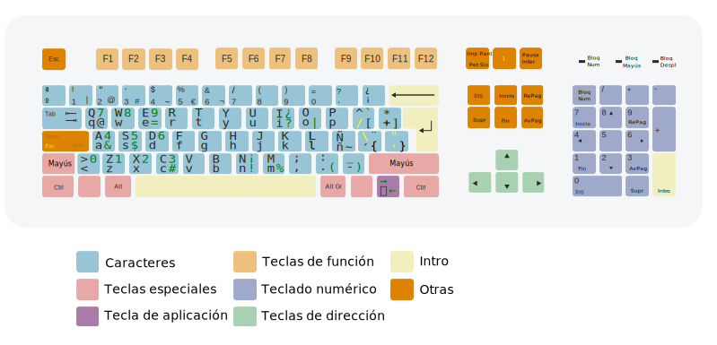
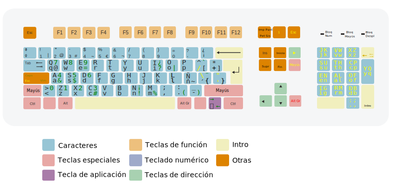
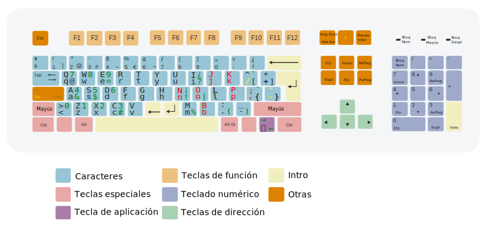
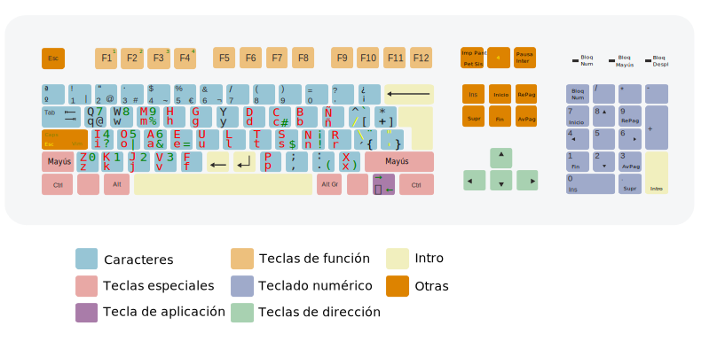

[[_TOC_]]

## Manual de uso ##

### Compilacion

```shell
make
```

### Instalacion ###

```shell
sudo cp dam /usr/share/X11/xkb/symbols
```

### Activacion ###

```shell
setxkbmap dam
```

## Layouts ##

### Base ###



### One Hand ###



### Colemak ###



### Dvorak ###


